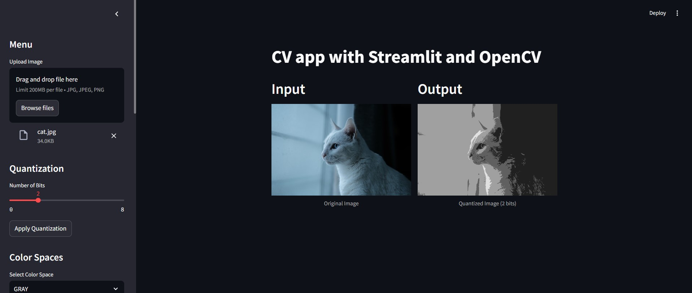

# Computer Vision Application with Streamlit and OpenCV

This project demonstrates a Computer Vision application built using Streamlit and OpenCV. The application allows users to upload images, apply various Image Processing techniques and visualize the results.

## Table of Contents
1. [Description](#description)
2. [Installation](#installation)
3. [Usage](#usage)
4. [GUI] (#gui)
5. [Contributing](#contributing)

## Description

This application includes functionalities for:
- Uploading images
- Performing uniform quantization
- Converting images to different color spaces
- Applying various filters (mean, median, Gaussian, bilateral)

The user can interact with the application through a sidebar interface in Streamlit.

## Installation

To run this application, you need to have Python and the required libraries installed. You can install the dependencies using pip:

```bash
pip install streamlit opencv-python-headless numpy
```

## Usage

To run the application, use the following command:

```bash
streamlit run src/app.py
```

## GUI (Graphical User Interface)

The application provides an intuitive and interactive graphical user interface (GUI) built with Streamlit. The main components of the GUI are designed to facilitate Image Processing tasks and offer a seamless user experience.



## Contributing

If you would like to contribute to this project, please fork the repository and submit a pull request. For major changes, please open an issue first to discuss what you would like to change.